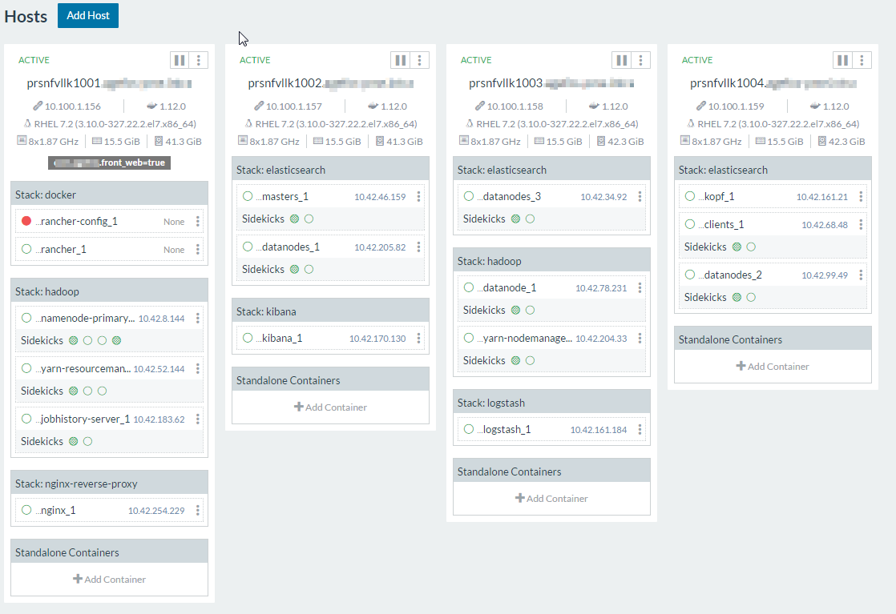

# NGinX Docker Rancher auto discovery and automatic reverse proxy for containers

This project adds the ability for Rancher clusters to automatically deploy and configure ``Nginx`` for all containers exposing
an environment variable named ``VIRTUAL_HOST``.

## What it does

Let's say you have a Rancher cluster like the one below:



What you see is an example of the full [ELK](https://elastic.co) stack with [Hadoop](https://hadoop.apache.org).

You see there are few web interfaces, ``Kopf`` and ``Kibana`` namely.

What this container does is to create the necessary configuration files for ``Nginx``
so that you can address the web interfaces by a typical URL like:

``https://kopf.service.<domain_name>``

Every option available in ``Nginx`` can be modified, including the default
vhost template.

> There is no possibility at the moment to specialize on a per vhost
basis as the point is to have a common configuration across the whole cluster.

This package also handles ``Nginx`` where it can serve as a load balancer for TCP/UDP
as this is required for applications like ``Logstash`` in this very example.
This is done using ``Nginx``  [streams](https://nginx.org/en/docs/stream/ngx_stream_core_module.html).

## Configuration sample

This is the most complete configuration deployed to date on a production environment.

### Docker-compose

Affinity here is useful when you plan to use specific (tagged) hosts to expose Web interfaces.

This should be a functionality that will appear in the next versions of Rancher, but in the meantime it works :smile:

```yaml
nginx:
  image: oorabona/nginx-rancher-rp
  labels:
    io.rancher.container.network: true
    io.rancher.container.hostname_override: container_name
    io.rancher.scheduler.affinity:host_label: ${affinity}
  environment:
    RANCHER_METADATA_HOST: ${rancher_host}
    IP_FIELD: ${ip_field_policy}
  ports:
   - "80:80"
   - "443:443"
  volumes:
    - '${base_dir}/certs:/etc/nginx/certs:ro'
    - '${base_dir}/nginx/vhosts.d:/etc/nginx/vhosts.d:ro'
    - '${base_dir}/nginx/html:/usr/share/nginx/html:ro'
```

### Rancher-compose

The above variables are context given by Rancher Catalog like in the example below.

```yaml
.catalog:
  name: "nginx-reverse-proxy"
  version: "latest-custom"
  description: "Automatic reverse proxy for your Web containers deployed in Rancher"
  questions:
    - variable: base_dir
      description: "Base directory for configuration files."
      label: "Base directory"
      type: "string"
      required: true
      default: "/srv"
    - variable: affinity
      label: "Rancher scheduler affinity, based on hosts labels!"
      description: "Can be any key=value pair..."
      type: "string"
      required: true
      default: "fq.label=value"
    - variable: rancher_host
      label: "Rancher Server Hostname"
      description: "External URL of Rancher host"
      type: "string"
      required: true
      default: "http://rancher:8080"
    - variable: ip_field_policy
      label: "Select which field in data.fields metadata should be the source of remote IP"
      description: "Select among the supported possibilities"
      type: "enum"
      default: primaryIpAddress
      options:
        - dockerIp
        - primaryIpAddress
```

## Setup

You can setup the container using either options:

### Rebuilding from Dockerfile

You will need to run the `ONBUILD` enabled `Dockerfile`.

```
FROM oorabona/nginx-rancher-rp:onbuild
```

With `nginx.conf` and `nginx-default-vhost.conf` files in the same directory.

```sh
$ mkdir nginx-foo-rp
$ cd nginx-foo-rp
$ ls
Dockerfile nginx.conf nginx-default-vhost.conf
$ docker build -t foo/nginx-foo-rp .
```

### Mounting volumes
